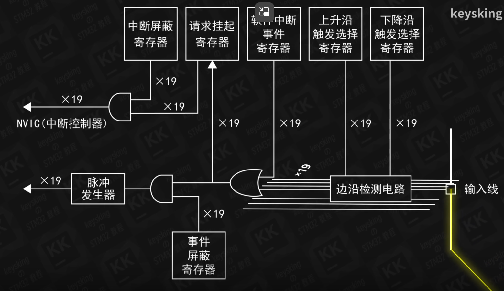
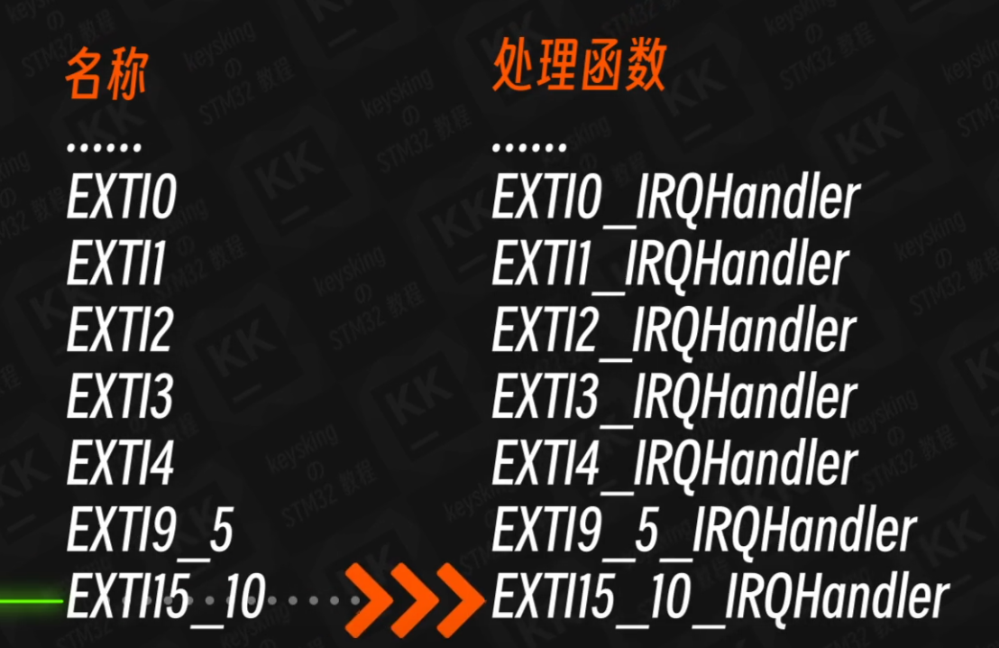

# 简单结构	

# 外部中断过程
1. 外部输入信号（若12号线）经过边沿检测电路检测为真，则传递真信号
2. 请求挂起寄存器将对应中断信号线的位（12）置位为1
3. 若同时中断屏蔽寄存器相应位（12）为1,表示开放中断则嵌套向量中断控制器（NVIC）找到对应中断向量（函数的地址）
4. 跳转到相应中断处理函数执行
	
5. 该中断处理函数中执行复位请求挂起寄存器的函数防护中断不断触发。

# 中断优先级
抢占优先级、响应优先级。
优先抢占优先级高的任务执行，同抢占优先级判断响应优先级，高者执行，若相同则按照中断向量表