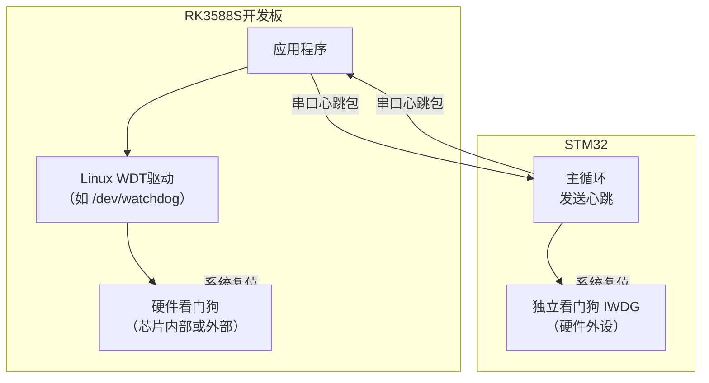
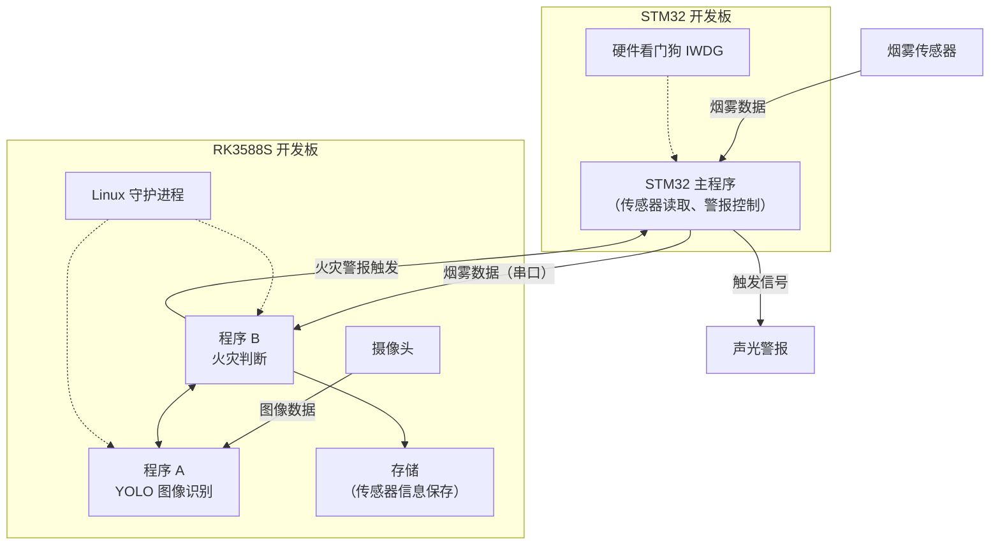
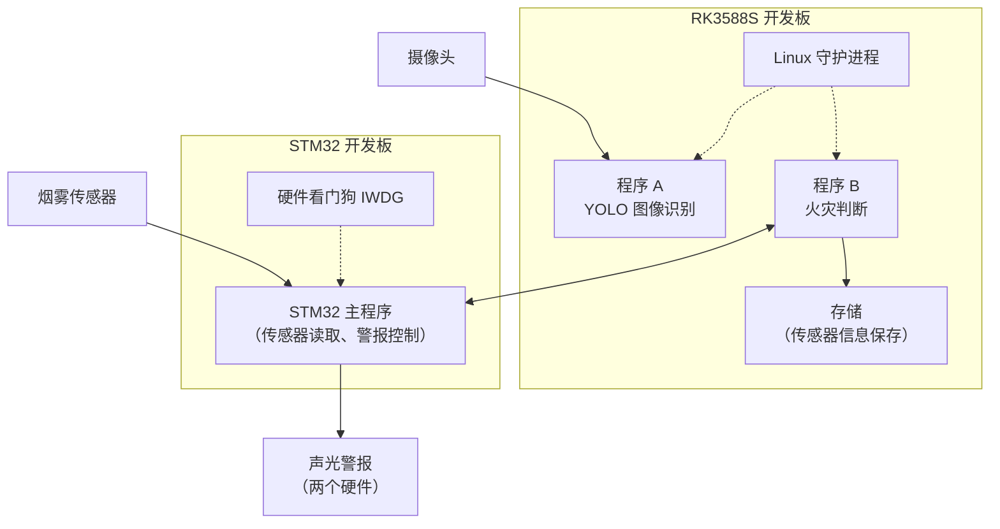

# 总体架构
- **RK3588S**：图像处理 + 数据管理 + 上位机界面 + 网络通信
- **STM32 / ESP32**：传感器采集 + 实时报警执行

## 1️⃣ RK3588S（Ubuntu）—— 核心计算节点 ⭐⭐⭐⭐⭐

**它负责什么：**
- 摄像头接入（USB / MIPI）
- 火焰 + 烟雾图像算法
- 实时画面显示
- 报警事件管理
- 历史数据存储
- 网络通信（以太网 / WiFi）
**为什么选它：**
- 算力强（ARM A76 + GPU / NPU）
- 跑 Ubuntu，开发效率高
- “图像处理” + “系统软件”味道很正

📌 论文里可以写：

> The RK3588S platform is used as the main processing unit to perform image processing and data management tasks.

---
## 2️⃣ STM32 / ESP32 —— 前端采集与控制节点 ⭐⭐⭐⭐
### 推荐：**STM32 优先，ESP32 备用**
**负责什么：**
- 烟雾传感器 ADC 采集
- 阈值判断（第一层保护）
- 声光报警控制
- 与 RK3588S 通信

**为什么要它：**

- 实时性强
- 稳定
- Linux 挂了它还能报警（这是答辩金句）

📌 论文表述：

> A microcontroller is used as the front-end node to ensure real-time sensor acquisition and alarm control.