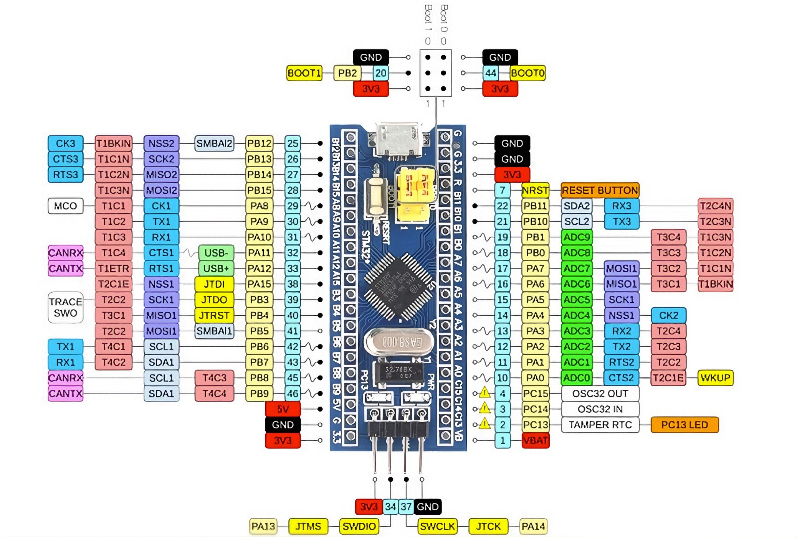

# 准备期间
	1.项目特点：1️⃣

> 本系统采用嵌入式 Linux 与微控制器协同的分层架构设计，将高算力图像处理任务与实时控制任务进行解耦。

2️⃣

> 通过图像识别结果与烟雾传感器数据的决策级融合，有效降低了误报率。

3️⃣

> 即使上位机系统发生异常，前端控制节点仍可独立完成报警任务，提高了系统的安全可靠性。

# Fire-node
1. PA0作为ADC接口，接入烟雾传感器
2. 两组uart，一组作为备份。分别为PA10_9(UART1), PA3_2(UART2)  
3. 两个GPIO，PB0和PB1分别作为运行指示灯和警报指示灯
	
	
	