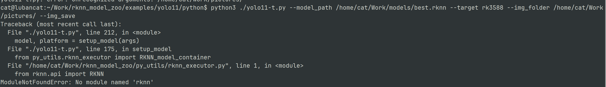
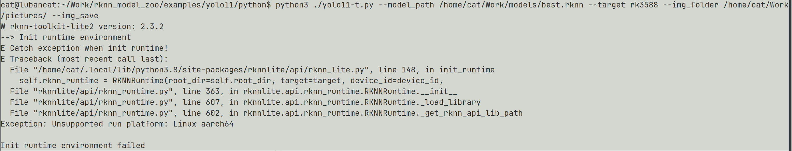

1.无法找到RKNN

解决：更改使用适合开发板的RKNNLite

2.设备类型不符，不支持arm64

https://doc.embedfire.com/linux/rk356x/Ai/zh/latest/lubancat_ai/env/toolkit_lite2.html#id3
原因：缺少板端运行库librknnrt.so
~~~bash
(base) yuan@yuan-TpX13G2:~/BiYeSheJi/pt-rknn$ scp -r ./RKSDK/rknn-toolkit2-master/rknpu2/runtime/Linux/librknn_api/aarch64/ cat@lubancat.local:/home/cat/lib
~~~
